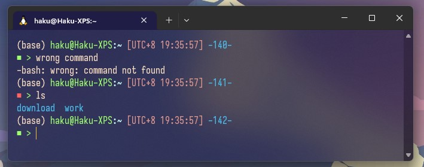
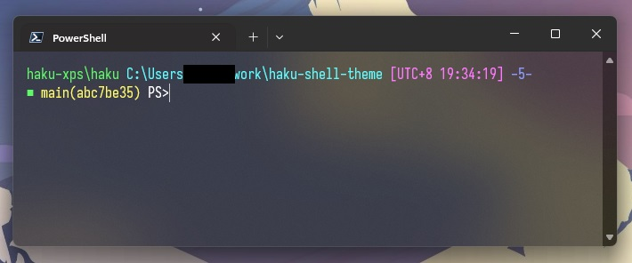

# Haku Shell 主题 | Haku Shell Theme

一个简洁而美观的shell主题，支持bash和powershell。  
A sleek and elegant shell theme for both bash and powershell.

## 预览 | Preview

### Bash主题 | Bash Theme



### Powershell主题 | Powershell Theme



## 安装 | Installation

1. **Bash用户 | Bash Users**:
    - 下载 `bash-theme-file-name` (请替换为实际的文件名)  
      Download `bash-theme-file-name` (please replace with the actual file name).
    - 在您的`.bashrc`文件中添加或替换现有主题代码  
      Add or replace the existing theme code in your `.bashrc` file.

   ```bash
   cat path-to-bash-theme-file-name >> ~/.bashrc
   source ~/.bashrc
   ```

2. **Powershell用户 | Powershell Users**:
    - 下载 `powershell-theme-file-name` (请替换为实际的文件名)  
      Download `powershell-theme-file-name` (please replace with the actual file name).
    - 在您的 `$PROFILE` 文件中添加或替换现有主题代码  
      Add or replace the existing theme code in your `$PROFILE` file.

   ```powershell
   Add-Content -Path $PROFILE -Value (Get-Content -Path path-to-powershell-theme-file-name)
   ```

## 贡献 | Contribution

如果你有任何建议或问题，请通过Issue告诉我们。欢迎Pull Requests!  
If you have any suggestions or issues, please let us know via issues. Pull requests are welcome!
